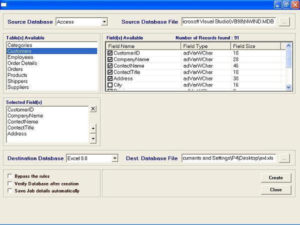



## Any\-to\-Any database converter

### Description

Using ADO & ADOX, convert between various

database formats like Text, Access, Excel,

dBASE, Paradox, HTML.
 
### More Info
 
you are not required to have that specific application installed to generate the destination (output) database. for example, without having Excel installed, you can create Excel sheet.

             |
---                |---
**Submitted On**   |2003-08-06 02:32:14
**By**             |[Vengadesh\.R](https://github.com/Planet-Source-Code/PSCIndex/blob/master/ByAuthor/vengadesh-r.md)
**Level**          |Beginner
**User Rating**    |5.0 (169 globes from 34 users)
**Compatibility**  |VB 6\.0
**Category**       |[Databases/ Data Access/ DAO/ ADO](https://github.com/Planet-Source-Code/PSCIndex/blob/master/ByCategory/databases-data-access-dao-ado__1-6.md)
**World**          |[Visual Basic](https://github.com/Planet-Source-Code/PSCIndex/blob/master/ByWorld/visual-basic.md)
**Archive File**   |[Any\-to\-Any1628008112003\.zip](https://github.com/Planet-Source-Code/vengadesh-r-any-to-any-database-converter__1-47434/archive/master.zip)

